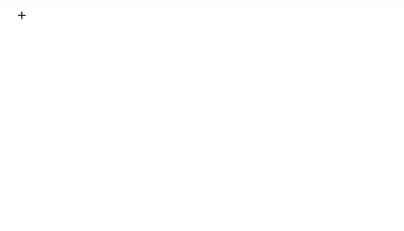

# editorjs-latex

Tools for entering latex in editorjs - based on katex



## how to use

add tools option like this

```js
    <script type="module">
      const editor = new EditorJS({
        autofocus: true,
        tools: {
          latex: {
            class: LaTeX,
          },
        },
      });
    </script>
```

## typescript

declare type like this in `d.ts` file

```js
declare module 'editorjs-simple-latex' {
    import LaTeX from 'editorjs-simple-latex';
    export = LaTeX;
}
```
